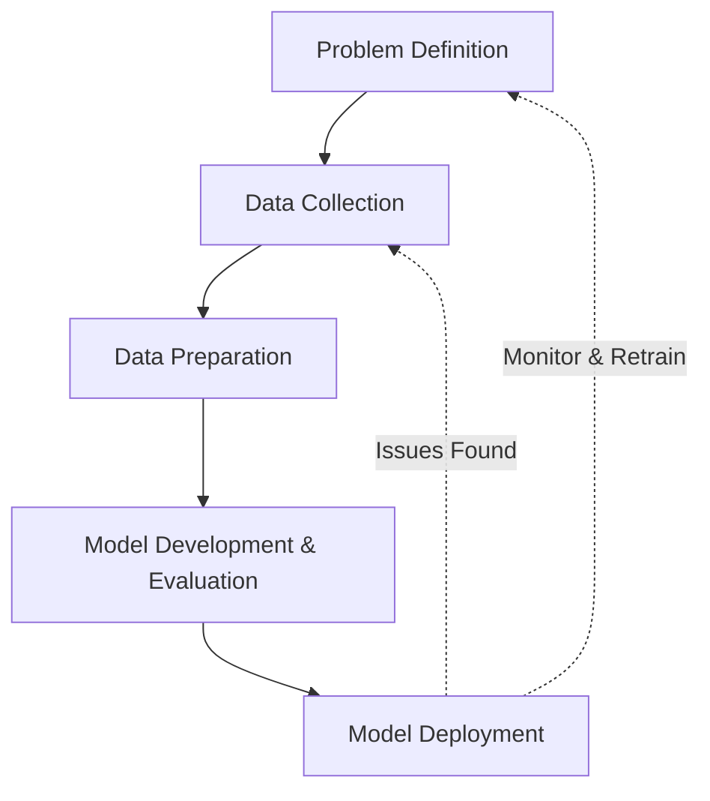

# Module 1: Intro To Machine Learning

## 1. An Overview of Machine Learning
**Artificial Intelligence (AI)** makes computers appear intelligent by simulating human cognitive abilities. 
**Machine Learning (ML)** is a subset of AI that uses algorithms and requires feature engineering to learn from data, identify patterns, and make decisions without explicit instructions.
**Deep Learning** distinguishes itself by using multi-layered neural networks to extract features from highly complex, unstructured data automatically.

### Learning Models
| Model Type | Description |
|---|---|
| **Supervised Learning** | Trains on labeled data to make inferences and predict unknown labels. |
| **Unsupervised Learning** | Works with unlabeled data to find hidden patterns. |
| **Semi-supervised Learning** | Trains on a small subset of labeled data and iteratively retrains itself by adding high-confidence self-generated labels. |
| **Reinforcement Learning** | Simulates an agent interacting with an environment, learning to make decisions based on feedback/rewards. |

### Common ML Techniques
- **Classification:** Categorizes data into predefined classes (e.g., benign vs. malignant cells).
- **Regression/Estimation:** Predicts continuous numerical values (e.g., house prices).
- **Clustering:** Groups similar data points (e.g., customer segmentation).
- **Association:** Finds co-occurring events or items (e.g., frequently bought together).
- **Anomaly Detection:** Discovers abnormal cases (e.g., fraud detection).
- **Sequence Mining:** Predicts the next event (e.g., clickstream analytics).
- **Dimension Reduction:** Reduces data size/features.
- **Recommendation Systems:** Associates preferences to recommend items.

---

## 2. Machine Learning Model Lifecycle
The ML lifecycle is highly **iterative**, often requiring revisiting earlier stages to improve the model.



**ETL (Extract, Transform, Load):** The process of gathering data from multiple sources, cleaning/transforming it, and storing it centrally for model building.

---

## 3. A Day in the Life of a Machine Learning Engineer
*Practical Example: Building a Beauty Product Recommendation System*
1. **Problem Definition:** Align with client needs (recommend products based on purchase history).
2. **Data Collection:** Gather user demographics, transactions, and product inventory.
3. **Data Preparation & EDA:** Clean data, handle missing values, and engineer features. Perform Exploratory Data Analysis (EDA) to find patterns.
4. **Model Development:** 
   - *Content-based filtering:* Recommends similar products based on product features (ingredients).
   - *Collaborative filtering:* Recommends products based on similar users' ratings.
5. **Evaluation:** Test on reserved data and collect user feedback.
6. **Deployment & Monitoring:** Deploy to the app and continuously monitor performance.

---

## 4. Data Scientist vs AI Engineer

| Aspect | Data Scientist | AI Engineer |
|---|---|---|
| **Primary Role** | Data Storyteller (transforms messy data into insights). | AI System Builder (transforms business processes using AI). |
| **Use Cases** | Descriptive & Predictive (EDA, regression, classification). | Prescriptive & Generative (Decision optimization, chatbots, intelligent assistants). |
| **Data Types** | Primarily **Structured (Tabular)** data. | Primarily **Unstructured** data (Text, Images, Audio). |
| **Models Used** | Specialized, smaller ML models trained from scratch on specific datasets. | Large Foundation Models (LLMs) generalized for many tasks without retraining. |
| **Workflow** | Feature engineering -> Train -> Validate -> Deploy. | Prompt Engineering -> Framework integration (RAG, PEFT) -> Embed in systems. |

---

## 5. Tools for Machine Learning
Data is the central fuel for ML models. 

### Programming Languages
- **Python:** Most popular due to extensive libraries.
- **R:** Great for statistical learning and exploration.
- **Others:** Julia (high-performance), Scala (big data pipelines), Java (scalable apps), JavaScript (client-side/web).

### Ecosystem & Tooling Categories
- **Data Processing/Analytics:** PostgreSQL, Hadoop, Spark, Apache Kafka, Pandas, NumPy.
- **Data Visualization:** Matplotlib, Seaborn, ggplot2 (R), Tableau.
- **Machine Learning:** Scikit-learn, SciPy.
- **Deep Learning:** TensorFlow, Keras, Theano, PyTorch.
- **Computer Vision:** OpenCV, Scikit-Image, TorchVision.
- **NLP:** NLTK, TextBlob, Stanza.
- **Generative AI:** Hugging Face Transformers, ChatGPT, DALL-E.

---

## 6. Scikit-learn Machine Learning Ecosystem
Scikit-learn is a free ML library for Python built on NumPy, SciPy, and Matplotlib. It contains implementations for classification, regression, clustering, and data preprocessing.

**Basic Scikit-learn Workflow (Code Snippet):**
```python
import numpy as np
from sklearn.preprocessing import StandardScaler
from sklearn.model_selection import train_test_split
from sklearn.svm import SVC
from sklearn.metrics import confusion_matrix
import pickle

# 1. Data Preprocessing (Scaling)
scaler = StandardScaler()
# X_scaled = scaler.fit_transform(X)

# 2. Splitting the Dataset (33% for testing)
# X_train, X_test, y_train, y_test = train_test_split(X_scaled, y, test_size=0.33, random_state=42)

# 3. Model Initialization (Support Vector Classifier)
clf = SVC(gamma='auto', C=1.0)

# 4. Model Training (Fitting)
# clf.fit(X_train, y_train)

# 5. Prediction
# predictions = clf.predict(X_test)

# 6. Evaluation
# matrix = confusion_matrix(y_test, predictions)

# 7. Save Model for Deployment
# with open('model.pkl', 'wb') as f:
#     pickle.dump(clf, f)
```
