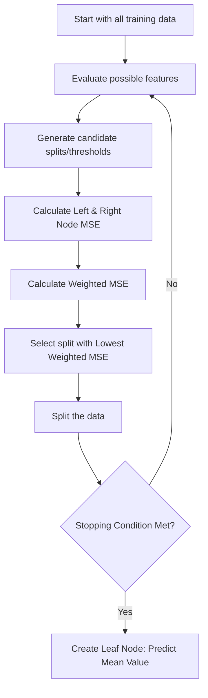

# Module 3: Building Supervised Learning Models

## 1. Classification

- **Concept:** Classification is a supervised learning technique that learns from labeled examples and predicts which category (or label) a new data point belongs to.
- **Key Points:** It maps input features to discrete output classes to make accurate predictions.

### Regression vs Classification

| Feature               | Regression               | Classification             |
| --------------------- | ------------------------ | -------------------------- |
| **Predicts**    | A number                 | A category or label        |
| **Output Type** | Continuous               | Discrete                   |
| **Examples**    | House price, Temperature | Spam / Not Spam, Cat / Dog |

### Applications

- **Real-Life:** Email Spam Detection, Speech-to-Text, Handwriting Recognition, Face Recognition, Document Classification.
- **Business Use-Cases:**
  - **Customer Churn Prediction:** Predicting if a customer will leave or cancel a service.
  - **Customer Segmentation:** Grouping customers (e.g., Premium vs Regular).
  - **Advertising Response:** Predicting if a customer will click an ad.
  - **Loan Default Prediction:** Predicting if a borrower will repay a loan based on age, income, credit score, etc.

### Types of Classification

- **Binary Classification:** The target variable has only two possible classes (e.g., Sick vs Healthy, Default vs No Default).
- **Multi-Class Classification:** The target variable has more than two classes (e.g., Predicting if a patient needs Drug A, Drug B, or Drug C).

### Common Classification Algorithms

- Naive Bayes (uses probability)
- Logistic Regression
- Decision Trees
- K-Nearest Neighbors (KNN)
- Support Vector Machines (SVM)
- Neural Networks

### Handling Multi-Class with Binary Classifiers

Some algorithms only naturally support binary classification. We can extend them to multi-class problems using two main strategies:

| Feature                      | One-vs-All (OvA)                                             | One-vs-One (OvO)                                                    |
| ---------------------------- | ------------------------------------------------------------ | ------------------------------------------------------------------- |
| **Idea**               | Train one classifier per class (Class A vs Everything Else). | Train a classifier for every possible pair of classes.              |
| **Classifiers Needed** | `K` (where K is number of classes)                         | `K(K-1)/2`                                                        |
| **Prediction**         | The class with the highest confidence score wins.            | Majority voting (ties are resolved using confidence probabilities). |
| **Best For**           | Many classes with a simpler setup.                           | Algorithms that naturally compare two classes.                      |


## 2. Decision Trees

- **Concept:** A supervised machine learning algorithm used mainly for Classification (and Regression). It models decisions as a flowchart, asking a series of Yes/No questions that eventually lead to a final category assignment.
- **Key Points:**
  - **Root Node:** The very first question/test.
  - **Internal Nodes:** Subsequent questions testing specific features.
  - **Leaf Node (Terminal Node):** The final answer or predicted class.

### How Decision Trees Learn

The algorithm uses **Recursive Partitioning** to repeatedly divide the data into smaller, more homogeneous groups:

1. Start with all training data at the root.
2. Find the feature that creates the **best separation** of classes.
3. Split the data based on that feature.
4. Repeat the process on each new branch until the nodes are **pure** (contain only one class) or a stopping criterion is met.

### Feature Selection & Splitting Criteria

The tree chooses features that best decrease the impurity (randomness) of the data.

- **Entropy:** Measures the disorder or uncertainty in a node.
  - A *completely pure* node (all data belongs to one class) has an Entropy of **0**.
  - A *completely mixed* node (evenly divided classes) has an Entropy of **1**.
  - The algorithm always seeks splits that result in the lowest entropy.
- **Information Gain:** The amount of uncertainty removed after a split. Calculated as `Entropy Before Split - Entropy After Split`. The tree selects the feature that yields the highest Information Gain.
- **Gini Impurity:** An alternative to Entropy. It serves the same purpose (measuring how mixed the classes are) but uses a simpler, faster calculation. It is widely used in algorithms like CART.

### Stopping Criteria & Pruning

If a tree grows too deep, it will memorize the training data, leading to **Overfitting** (poor performance on new, unseen data).

- **Stopping Criteria (Pre-emptive Pruning):** Rules to stop the tree from growing indefinitely (e.g., maximum tree depth, minimum samples required to split a node, minimum samples in a leaf).
- **Pruning:** The process of cutting back branches that do not significantly improve performance. This simplifies the model and makes it better at generalizing to new data.

### Advantages vs Disadvantages

| Advantages                                             | Disadvantages                                                       |
| ------------------------------------------------------ | ------------------------------------------------------------------- |
| Easy to understand and interpret (can be visualized).  | Prone to overfitting if not pruned.                                 |
| Requires little data preprocessing.                    | Small changes in data can create a completely different tree.       |
| Naturally handles both categorical and numerical data. | Usually less accurate than ensemble methods (e.g., Random Forests). |
| Clearly shows feature importance.                      | Large trees can become slow and overly complex.                     |

## 3. Regression Trees

- **Concept:** A regression tree is a type of decision tree used when we want to predict a **continuous numerical value** (e.g., house price, temperature, salary) rather than a categorical class.
- **Key Points:** 
  - Recursively chooses the feature and threshold that minimize the weighted prediction error.
  - The prediction at a leaf is typically the **mean target value** (or median for highly skewed data) of the training samples that reach that leaf.

### Classification Tree vs Regression Tree

| Feature | Classification Tree | Regression Tree |
|---|---|---|
| **Target** | Categorical | Continuous |
| **Prediction** | Class | Number |
| **Example** | Spam / Not Spam | House Price, Salary |
| **Leaf Prediction** | Majority class vote | Average (mean) target value |
| **Split Criterion** | Gini / Entropy / Information Gain | Mean Squared Error (MSE) / Variance reduction |

### How Regression Trees Split Data (MSE)

Regression trees attempt to make numerical values inside each node as close together as possible (low variance).
- **Mean Squared Error (MSE):** Measures how spread out the values are inside a node. Lower MSE means the values are highly similar.
- **Weighted MSE:** When evaluating a split, the tree calculates the MSE for the resulting left and right child nodes, then calculates their weighted average. The best split is always the one with the lowest Weighted MSE.

### Handling Different Feature Types

- **Continuous Features:** Candidate thresholds are chosen as the **midpoints** between sorted, unique values of the feature.
- **Binary Features:** Split directly into the two categories.
- **Multi-class Categorical Features:** The tree evaluates possible binary partitions to find the one with the lowest weighted MSE.

### Training Process Workflow



## Code Examples

```python
# ── Classification Tree Example ──────────────────────────────────────────────
from sklearn.tree import DecisionTreeClassifier
from sklearn.model_selection import train_test_split
from sklearn.metrics import accuracy_score
import pandas as pd

# Assume X (features) and y (categorical target) are already defined
X_train, X_test, y_train, y_test = train_test_split(X, y, test_size=0.3, random_state=42)

# Initialize and train
clf = DecisionTreeClassifier(criterion='entropy', max_depth=4)
clf.fit(X_train, y_train)

# Predict and evaluate
y_pred = clf.predict(X_test)
print(f"Classification Accuracy: {accuracy_score(y_test, y_pred):.4f}")


# ── Regression Tree Example ──────────────────────────────────────────────────
from sklearn.tree import DecisionTreeRegressor
from sklearn.metrics import mean_squared_error

# Assume X_reg (features) and y_reg (continuous target) are already defined
X_train_r, X_test_r, y_train_r, y_test_r = train_test_split(X_reg, y_reg, test_size=0.3, random_state=42)

# Initialize and train (uses MSE by default)
reg = DecisionTreeRegressor(criterion='squared_error', max_depth=4)
reg.fit(X_train_r, y_train_r)

# Predict and evaluate
y_pred_r = reg.predict(X_test_r)
print(f"Regression MSE: {mean_squared_error(y_test_r, y_pred_r):.2f}")
```
