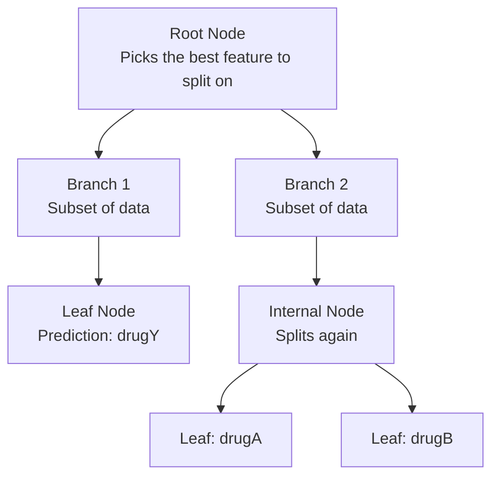

# 🌳 Decision Trees Lab — Complete Guide (Modern Python)

> [!NOTE]
> This guide walks you through the **Decision Trees** lab from Module 3, rewritten using **modern Python best practices** (Python 3.10+, scikit-learn 1.6+, pandas 2.x). Every section includes clear explanations so you understand *what* each step does and *why*.

---

## 📌 Lab Objective

Build a **multiclass classification model** using the Decision Tree algorithm to predict which drug a patient should be prescribed, based on their health parameters.

**By the end you'll know how to:**
- Load and explore a dataset
- Encode categorical features for machine learning
- Split data into training and testing sets
- Train a Decision Tree classifier
- Evaluate accuracy and visualize the tree

---

## 1. The Dataset — What Are We Working With?

| Feature | Type | Description |
|---|---|---|
| `Age` | Numeric | Patient's age |
| `Sex` | Categorical | `F` (Female) or `M` (Male) |
| `BP` | Categorical | Blood Pressure — `HIGH`, `LOW`, `NORMAL` |
| `Cholesterol` | Categorical | `HIGH` or `NORMAL` |
| `Na_to_K` | Numeric | Sodium-to-Potassium ratio in blood |
| **`Drug`** | **Target** | Drug the patient responded to: `drugA`, `drugB`, `drugC`, `drugX`, `drugY` |

**Scenario:** You're a medical researcher. Patients suffering from the same illness responded to one of five drugs. Your model should predict the correct drug for a future patient.

---

## 2. Importing Libraries

```python
# ── Standard scientific stack ──────────────────────────────────────
import numpy as np
import pandas as pd
import matplotlib.pyplot as plt

# ── Scikit-Learn ───────────────────────────────────────────────────
from sklearn.preprocessing import LabelEncoder
from sklearn.model_selection import train_test_split
from sklearn.tree import DecisionTreeClassifier, plot_tree
from sklearn.metrics import accuracy_score, classification_report
```

### What changed from the original?

| Old (Lab Notebook) | Modern Best Practice |
|---|---|
| `from matplotlib import pyplot as plt` | `import matplotlib.pyplot as plt` — the canonical import |
| `from sklearn import metrics` then `metrics.accuracy_score(...)` | Import `accuracy_score` directly — cleaner, explicit |
| `%matplotlib inline` | Not needed in modern Jupyter (≥ 7) / VS Code notebooks |
| `warnings.filterwarnings('ignore')` | Removed — hiding warnings hides bugs. If a specific warning is noisy, filter only that one. |

---

## 3. Loading the Data

```python
DATA_URL = (
    "https://cf-courses-data.s3.us.cloud-object-storage.appdomain.cloud/"
    "IBMDeveloperSkillsNetwork-ML0101EN-SkillsNetwork/"
    "labs/Module%203/data/drug200.csv"
)

df = pd.read_csv(DATA_URL)
df.head()
```

### 💡 Key Points
- **Use `UPPER_CASE` for constants** like URLs — PEP 8 convention.
- **Name DataFrames `df`** (or something descriptive) instead of `my_data` — more Pythonic.
- **Use `.head()`** instead of printing the whole frame; with 200 rows `.head()` is safer.

---

## 4. Exploratory Data Analysis (EDA)

### 4.1 Quick Info

```python
df.info()
```

**What this tells you:**
- 200 rows, 6 columns
- `Age` and `Na_to_K` are numeric; `Sex`, `BP`, `Cholesterol`, `Drug` are objects (strings)
- No null values (all 200 non-null)

### 4.2 Check for Missing Values

```python
df.isnull().sum()
```

Output: **All zeros** — no missing data in any column. ✅

### 4.3 Class Distribution

```python
fig, ax = plt.subplots(figsize=(8, 5))

drug_counts = df["Drug"].value_counts()
colors = ["#6366f1", "#8b5cf6", "#a78bfa", "#c4b5fd", "#ddd6fe"]

ax.bar(drug_counts.index, drug_counts.values, color=colors, edgecolor="white")
ax.set_xlabel("Drug", fontsize=12)
ax.set_ylabel("Count", fontsize=12)
ax.set_title("Drug Category Distribution", fontsize=14, fontweight="bold")
ax.tick_params(axis="x", rotation=45)

plt.tight_layout()
plt.show()
```

**Observation:** `drugX` and `drugY` dominate the dataset; `drugA`, `drugB`, `drugC` have fewer samples. This is a **class imbalance** — something to be aware of.

### 4.4 Correlation Analysis

To see which features most influence the target, map drugs to numbers and compute correlation:

```python
drug_mapping = {"drugA": 0, "drugB": 1, "drugC": 2, "drugX": 3, "drugY": 4}
df["Drug_num"] = df["Drug"].map(drug_mapping)

# Correlation of numeric features with the target
df.select_dtypes(include="number").corr()["Drug_num"].drop("Drug_num").sort_values(ascending=False)
```

**Result:** `Na_to_K` has the strongest correlation with the drug, followed by `BP`. These are the most important features.

> [!TIP]
> Using `select_dtypes(include="number")` is safer than manually dropping columns — it automatically excludes non-numeric columns.

---

## 5. Data Preprocessing — Encoding Categorical Features

Machine learning models need **numbers**, not strings. We use `LabelEncoder` to convert categorical columns.

### Original Lab Approach (Problematic ⚠️)

```python
# ❌ Old approach — reuses the SAME encoder for different columns
label_encoder = LabelEncoder()
my_data['Sex']         = label_encoder.fit_transform(my_data['Sex'])
my_data['BP']          = label_encoder.fit_transform(my_data['BP'])
my_data['Cholesterol'] = label_encoder.fit_transform(my_data['Cholesterol'])
```

> [!WARNING]
> **Why is this bad?** Reusing one `LabelEncoder` across columns means each `fit_transform` overwrites the previous mapping. If you later need to **inverse-transform** a specific column (e.g., decode `BP` back to `"HIGH"`, `"LOW"`, `"NORMAL"`), you can't — the encoder only remembers the last column it was fit on (`Cholesterol`).

### Modern Approach ✅

```python
# ── Create a separate encoder per categorical column ───────────────
encoders: dict[str, LabelEncoder] = {}
categorical_cols = ["Sex", "BP", "Cholesterol"]

for col in categorical_cols:
    enc = LabelEncoder()
    df[col] = enc.fit_transform(df[col])
    encoders[col] = enc          # store for potential inverse_transform later

# Verify the mappings
for col, enc in encoders.items():
    mapping = dict(zip(enc.classes_, enc.transform(enc.classes_)))
    print(f"{col}: {mapping}")
```

**Output:**
```
Sex:         {'F': 0, 'M': 1}
BP:          {'HIGH': 0, 'LOW': 1, 'NORMAL': 2}
Cholesterol: {'HIGH': 0, 'NORMAL': 1}
```

### 💡 Why This Is Better
- **Each column gets its own encoder** → you can reverse any encoding later.
- **`dict[str, LabelEncoder]` type hint** → makes intent clear (Python 3.9+).
- **Explicit mapping printout** → no guessing what numbers mean.

---

## 6. Splitting Into Features (X) and Target (y)

```python
X = df.drop(columns=["Drug", "Drug_num"])   # Features
y = df["Drug"]                                # Target (original string labels)
```

> [!NOTE]
> We keep `y` as the **original string labels** (`"drugA"`, etc.), not the numeric mapping. Scikit-learn's `DecisionTreeClassifier` handles string labels natively.

### Modern Improvement: `drop(columns=[...])` vs `drop([...], axis=1)`

| Old Style | Modern Style |
|---|---|
| `df.drop(['Drug', 'Drug_num'], axis=1)` | `df.drop(columns=["Drug", "Drug_num"])` |
| Less readable — what is `axis=1`? | Self-documenting — clearly dropping *columns* |

---

## 7. Train/Test Split

```python
X_train, X_test, y_train, y_test = train_test_split(
    X, y,
    test_size=0.3,      # 30% for testing, 70% for training
    random_state=32,     # reproducibility
    stratify=y,          # ← NEW: keeps class proportions balanced in both sets
)

print(f"Training set: {X_train.shape[0]} samples")
print(f"Testing set:  {X_test.shape[0]} samples")
```

### What's new?

| Feature | Explanation |
|---|---|
| `stratify=y` | Ensures the train/test split preserves the same proportion of each drug class. Without this, you might get a test set with no `drugC` samples! |
| f-string prints | Cleaner than concatenation |

---

## 8. Training the Decision Tree

```python
drug_tree = DecisionTreeClassifier(
    criterion="entropy",    # Information Gain (vs. "gini" for Gini Impurity)
    max_depth=4,            # Limit tree depth to prevent overfitting
    random_state=42,        # Reproducible splits
)

drug_tree.fit(X_train, y_train)
```

### 🧠 Understanding the Parameters

| Parameter | What It Does |
|---|---|
| `criterion="entropy"` | Uses **Information Gain** (based on entropy) to decide splits. Alternative: `"gini"` (Gini Impurity) — slightly faster, usually similar results. |
| `max_depth=4` | Limits the tree to 4 levels deep. Prevents overfitting by stopping early. |
| `random_state=42` | Makes results reproducible. Without it, tie-breaking between equally good splits is random. |

### 📖 How Does a Decision Tree Work?



1. **Start at the root** — the algorithm picks the feature that best separates the classes (highest information gain).
2. **Split the data** based on that feature's values.
3. **Repeat recursively** for each branch until:
   - All samples in a node belong to one class (pure node), OR
   - `max_depth` is reached, OR
   - No further improvement is possible.

---

## 9. Evaluation

### 9.1 Predictions

```python
y_pred = drug_tree.predict(X_test)
```

### 9.2 Accuracy

```python
accuracy = accuracy_score(y_test, y_pred)
print(f"Decision Tree Accuracy: {accuracy:.2%}")
```

**Expected Output:** `Decision Tree Accuracy: 98.33%` — 59 out of 60 test samples classified correctly!

### 9.3 Full Classification Report (Modern Addition)

```python
print(classification_report(y_test, y_pred))
```

This gives you **precision, recall, and F1-score per class** — much more informative than accuracy alone, especially with imbalanced data.

| Metric | What It Measures |
|---|---|
| **Precision** | Of all samples predicted as class X, how many actually *are* class X? |
| **Recall** | Of all actual class X samples, how many were correctly predicted? |
| **F1-Score** | Harmonic mean of precision and recall — balances both |

> [!IMPORTANT]
> **Accuracy alone can be misleading** with imbalanced datasets. If 90% of data is `drugY`, a model that always predicts `drugY` gets 90% accuracy but is useless. The classification report reveals this.

---

## 10. Visualizing the Decision Tree

```python
fig, ax = plt.subplots(figsize=(20, 10))

plot_tree(
    drug_tree,
    feature_names=X.columns.tolist(),
    class_names=drug_tree.classes_.tolist(),
    filled=True,           # Color nodes by majority class
    rounded=True,          # Rounded node boxes
    fontsize=10,
    ax=ax,
)

ax.set_title("Drug Prediction Decision Tree", fontsize=16, fontweight="bold")
plt.tight_layout()
plt.show()
```

### Improvements Over the Original

| Old | Modern |
|---|---|
| `plot_tree(drugTree)` — no labels, no colors | `filled=True, rounded=True, feature_names=..., class_names=...` — fully annotated, colored by class |
| Tiny unreadable figure | `figsize=(20, 10)` — large enough to read every node |

### 📖 How to Read the Tree

Each node shows:
- **Split condition** (e.g., `Na_to_K <= 14.627`)
- **Entropy** — measure of impurity (0 = pure, all one class)
- **Samples** — how many training samples reach this node
- **Value** — count of each class in this node
- **Class** — the majority class (what it would predict if this were a leaf)

### Decision Rules Derived from the Tree

| Drug | Decision Path |
|---|---|
| **Drug Y** | `Na_to_K > 14.627` |
| **Drug A** | `Na_to_K ≤ 14.627` → `BP = HIGH` → `Age ≤ 50.5` |
| **Drug B** | `Na_to_K ≤ 14.627` → `BP = HIGH` → `Age > 50.5` |
| **Drug C** | `Na_to_K ≤ 14.627` → `BP = LOW` → `Cholesterol = HIGH` |
| **Drug X** | `Na_to_K ≤ 14.627` → `BP = NORMAL` (or `LOW + Cholesterol = NORMAL`) |

---

## 11. Practice: Effect of Reducing `max_depth` to 3

```python
# Train a shallower tree
shallow_tree = DecisionTreeClassifier(
    criterion="entropy",
    max_depth=3,
    random_state=42,
)
shallow_tree.fit(X_train, y_train)

y_pred_shallow = shallow_tree.predict(X_test)
accuracy_shallow = accuracy_score(y_test, y_pred_shallow)

print(f"Depth=4 Accuracy: {accuracy:.2%}")
print(f"Depth=3 Accuracy: {accuracy_shallow:.2%}")
```

**What to expect:** With `max_depth=3`, the tree has fewer splits and may not be able to separate all 5 drug classes as well. Accuracy typically drops because the tree can't capture the finer distinctions (e.g., between Drug C and Drug X, which require a 4th level split).

> [!TIP]
> This illustrates the **bias-variance tradeoff**: shallower trees are simpler (lower variance, less overfitting) but may underfit (higher bias). Finding the right `max_depth` is key!

---

## 12. Complete Modern Script

Here's the **entire lab** condensed into a single, clean, modern Python script:

```python
"""Decision Tree Classification — Drug Prediction.

Predicts which drug a patient should be prescribed based on
Age, Sex, Blood Pressure, Cholesterol, and Na-to-K ratio.
"""

import pandas as pd
import matplotlib.pyplot as plt
from sklearn.preprocessing import LabelEncoder
from sklearn.model_selection import train_test_split
from sklearn.tree import DecisionTreeClassifier, plot_tree
from sklearn.metrics import accuracy_score, classification_report

# ── 1. Load Data ──────────────────────────────────────────────────
DATA_URL = (
    "https://cf-courses-data.s3.us.cloud-object-storage.appdomain.cloud/"
    "IBMDeveloperSkillsNetwork-ML0101EN-SkillsNetwork/"
    "labs/Module%203/data/drug200.csv"
)
df = pd.read_csv(DATA_URL)

# ── 2. EDA ────────────────────────────────────────────────────────
print(df.info())
print(df.isnull().sum())

# ── 3. Encode Categorical Features ───────────────────────────────
encoders: dict[str, LabelEncoder] = {}
for col in ["Sex", "BP", "Cholesterol"]:
    enc = LabelEncoder()
    df[col] = enc.fit_transform(df[col])
    encoders[col] = enc

# ── 4. Correlation Analysis ──────────────────────────────────────
drug_map = {"drugA": 0, "drugB": 1, "drugC": 2, "drugX": 3, "drugY": 4}
df["Drug_num"] = df["Drug"].map(drug_map)
print(
    df.select_dtypes(include="number")
    .corr()["Drug_num"]
    .drop("Drug_num")
    .sort_values(ascending=False)
)

# ── 5. Feature / Target Split ────────────────────────────────────
X = df.drop(columns=["Drug", "Drug_num"])
y = df["Drug"]

# ── 6. Train / Test Split ────────────────────────────────────────
X_train, X_test, y_train, y_test = train_test_split(
    X, y, test_size=0.3, random_state=32, stratify=y,
)

# ── 7. Train Decision Tree ───────────────────────────────────────
drug_tree = DecisionTreeClassifier(
    criterion="entropy", max_depth=4, random_state=42,
)
drug_tree.fit(X_train, y_train)

# ── 8. Evaluate ──────────────────────────────────────────────────
y_pred = drug_tree.predict(X_test)
print(f"\nAccuracy: {accuracy_score(y_test, y_pred):.2%}")
print(classification_report(y_test, y_pred))

# ── 9. Visualize ─────────────────────────────────────────────────
fig, ax = plt.subplots(figsize=(20, 10))
plot_tree(
    drug_tree,
    feature_names=X.columns.tolist(),
    class_names=drug_tree.classes_.tolist(),
    filled=True, rounded=True, fontsize=10, ax=ax,
)
ax.set_title("Drug Prediction Decision Tree", fontsize=16, fontweight="bold")
plt.tight_layout()
plt.show()
```

---

## 13. Summary — Old vs Modern Cheatsheet

| Area | Old Lab Code | Modern Best Practice |
|---|---|---|
| **Imports** | `from matplotlib import pyplot as plt` | `import matplotlib.pyplot as plt` |
| **Metrics** | `from sklearn import metrics` → `metrics.accuracy_score()` | `from sklearn.metrics import accuracy_score` (explicit) |
| **Warnings** | `warnings.filterwarnings('ignore')` | Don't suppress all warnings |
| **LabelEncoder** | One encoder reused for all columns | One encoder per column, stored in a dict |
| **Drop columns** | `df.drop([...], axis=1)` | `df.drop(columns=[...])` |
| **Variable names** | `my_data`, `drugTree`, `X_trainset` | `df`, `drug_tree`, `X_train` (PEP 8 snake_case) |
| **Train/test split** | No `stratify` | `stratify=y` to preserve class balance |
| **Evaluation** | Accuracy only | Accuracy + `classification_report` |
| **Tree plot** | `plot_tree(drugTree)` — bare | `filled`, `rounded`, feature/class names, proper figure size |
| **Strings** | Concatenation or `%` formatting | f-strings |
| **Type hints** | None | `dict[str, LabelEncoder]` |
| **Constants** | Inline strings | `UPPER_CASE` named constants |

---

## 🔑 Key Takeaways

1. **Decision Trees are interpretable** — you can trace exactly *why* a prediction was made by following the tree from root to leaf.
2. **`Na_to_K` is the strongest predictor** — the very first split uses it, separating Drug Y from everything else.
3. **`max_depth` controls complexity** — deeper trees fit training data better but risk overfitting; shallower trees generalize better but may underfit.
4. **Entropy vs. Gini** — both measure impurity. Entropy uses logarithms (information theory), Gini is simpler. In practice, results are very similar.
5. **Always use `stratify` in `train_test_split`** when you have imbalanced classes — it prevents unlucky splits.
6. **Go beyond accuracy** — use `classification_report` to see precision, recall, and F1 per class.
